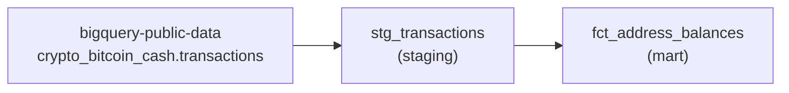

# BitcoinCashDbtAnalysis — A to Z overview

This project sets up a **data analysis pipeline** for the **Bitcoin Cash (BCH)** blockchain. It uses **dbt** to transform raw data in **BigQuery**, with **GCP** infrastructure provisioned by **Terraform**, and a **GitHub Actions CI** that runs the models on every pull request.

> **Note:** The code relies on the public BigQuery dataset `bigquery-public-data.crypto_bitcoin_cash`

---

## Design decisions

### 3-month window (staging and mart)

The challenge brief requires a staging layer limited to the **last three months** of transactions. Querying the entire Bitcoin Cash blockchain on BigQuery (billions of rows) triggers massive scans and **high query costs**. We therefore applied this window **consistently across the whole pipeline**: staging filters the last 3 months, and the balance mart builds on that staging rather than on full history. This is a deliberate trade-off between fidelity to the *"current balance"* wording and keeping BigQuery costs under control, in line with the spirit of the brief.

### Monorepo

The deliverable suggests **two repositories** (one for Terraform, one for dbt + GitHub Actions). We chose a **monorepo** for simplicity: infrastructure, dbt models, and CI live in one place (`terraform/` at the root, dbt and `.github/` alongside). For a project of this size, that avoids duplicated configuration and makes navigation easier during review or demo.

---

## A. Business objective

The goal is to analyse Bitcoin Cash activity over a **rolling 3-month window** and compute **per-address balances** over that period, **excluding mining addresses** (those that received at least one *coinbase* transaction).

Data flow:



---

## B. Tech stack

| Layer | Technology |
|-------|------------|
| Transformation | dbt (dbt-bigquery ≥ 1.8) |
| Data warehouse | Google BigQuery |
| Data source | Public dataset `bigquery-public-data` |
| Infra | Terraform (Google provider ~> 5.0) |
| CI/CD | GitHub Actions |
| dbt package | `dbt-labs/dbt_utils` |

Minimal Python dependency:

```1:1:requirements.txt
dbt-bigquery>=1.8.0,<2.0.0
```

---

## C. dbt configuration (`dbt_project.yml`)

The project is named `bitcoin_cash_dbt` and organises models in two layers:

```18:25:dbt_project.yml
models:
  bitcoin_cash_dbt:
    staging:
      +schema: staging
      +materialized: table
    marts:
      +schema: mart
      +materialized: table
```

- **staging** → BigQuery dataset `staging` (cleaned intermediate tables)
- **marts** → BigQuery dataset `mart` (final analytical tables)

A custom macro controls schema naming: instead of dbt’s default behaviour (`target_schema_custom_schema`), models land directly in `staging` or `mart`:

```1:7:macros/generate_schema_name.sql

    
        {{ target.schema }}
    
        {{ custom_schema_name | trim }}
    

```

---

## D. Data source (`models/sources.yml`)

The only source is the public BigQuery Bitcoin Cash dataset:

```3:16:models/sources.yml
sources:
  - name: crypto_bitcoin_cash
    description: BigQuery public Bitcoin Cash blockchain dataset
    database: bigquery-public-data
    schema: crypto_bitcoin_cash
    tables:
      - name: transactions
        description: Raw Bitcoin Cash transactions
        columns:
          - name: hash
            description: Transaction hash
          - name: block_timestamp
            description: Block timestamp of the transaction
          - name: is_coinbase
            description: True if this is a mining reward (coinbase) transaction
```

Each transaction includes nested `inputs` and `outputs` fields (with addresses and amounts in satoshis).

**Important:** this public dataset stopped being ingested around **May 2024**. The 3-month window is therefore computed relative to the **latest available date**, not `CURRENT_DATE()`.

---

## E. Staging layer — `stg_transactions`

This model filters transactions to the **last 3 months** relative to `MAX(block_timestamp)` in the source:

```15:28:models/staging/stg_transactions.sql
with source_bounds as (
    select max(block_timestamp) as max_block_timestamp
    from {{ source('crypto_bitcoin_cash', 'transactions') }}
),

window_start as (
    select
        max_block_timestamp,
        timestamp(date_sub(date(max_block_timestamp), interval 3 month)) as start_timestamp,
        date_trunc(
            date_sub(date(max_block_timestamp), interval 3 month),
            month
        ) as start_month
    from source_bounds
)
```

The final query selects all useful columns and applies the time filter:

```31:53:models/staging/stg_transactions.sql
select
    `hash` as transaction_hash,
    `size`,
    virtual_size,
    `version`,
    lock_time,
    block_number,
    block_hash,
    block_timestamp,
    block_timestamp_month,
    is_coinbase,
    inputs,
    outputs,
    input_count,
    output_count,
    input_value,
    output_value,
    fee
from {{ source('crypto_bitcoin_cash', 'transactions') }} as tx
cross join window_start as w
where tx.block_timestamp_month >= w.start_month
  and tx.block_timestamp >= w.start_timestamp
  and tx.block_timestamp <= w.max_block_timestamp
```

BigQuery optimisations:
- **Partitioning** by day on `block_timestamp`
- **Clustering** on `is_coinbase` (useful when filtering mining transactions)

Quality tests are defined in `models/staging/schema.yml`: `transaction_hash` unique and not null, `block_timestamp` and `is_coinbase` not null.

---

## F. Mart layer — `fct_address_balances`

This is the final analytical model. It computes the **net balance per address** over the 3-month window using **double-entry** accounting:

1. **Credits**: amounts received via `outputs`
2. **Debits**: amounts spent via `inputs` (as negatives)

```16:38:models/marts/fct_address_balances.sql
double_entry as (
    -- Credits (outputs received)
    select
        address,
        output.value as value
    from {{ ref('stg_transactions') }} as tx
    cross join unnest(tx.outputs) as output
    cross join unnest(output.addresses) as address
    where address is not null
      and address != ''

    union all

    -- Debits (inputs spent)
    select
        address,
        -input.value as value
    from {{ ref('stg_transactions') }} as tx
    cross join unnest(tx.inputs) as input
    cross join unnest(input.addresses) as address
    where address is not null
      and address != ''
),
```

Then aggregation per address:

```40:46:models/marts/fct_address_balances.sql
balances as (
    select
        address,
        sum(value) as balance
    from double_entry
    group by address
)
```

**Miner exclusion:** any address that received at least one *coinbase* reward is filtered out:

```6:14:models/marts/fct_address_balances.sql
with coinbase_addresses as (
    select distinct address
    from {{ ref('stg_transactions') }} as tx
    cross join unnest(tx.outputs) as output
    cross join unnest(output.addresses) as address
    where tx.is_coinbase
      and address is not null
      and address != ''
),
```

Final output: an `address` + `balance` table (in satoshis), with `unique` and `not_null` tests on both columns.

---

## G. Terraform infrastructure (`terraform/`)

Terraform provisions all required GCP infrastructure.

### 1. GCP project creation

```7:18:terraform/project.tf
resource "google_project" "bch_analysis" {
  name            = var.project_name
  project_id      = var.project_id
  billing_account = var.billing_account
  org_id          = local.parent_org_id
  folder_id       = local.parent_folder_id
  labels          = var.labels

  # Personal / free-trial accounts often have no org — omit both parents.
  # Prevent accidental deletion of a billed project from local state mistakes.
  deletion_policy = "PREVENT"
}
```

It also enables the required APIs (BigQuery, IAM, etc.).

### 2. BigQuery datasets

Two datasets are created in the **US** region (required to query `bigquery-public-data`):

```1:15:terraform/bigquery.tf
resource "google_bigquery_dataset" "staging" {
  project                     = google_project.bch_analysis.project_id
  dataset_id                  = var.staging_dataset_id
  friendly_name               = "Staging"
  description                 = "Staging tables for Bitcoin Cash dbt models (cleaned / intermediate)"
  location                    = var.bigquery_location
  ...
}
```

Same for the `mart` dataset.

### 3. IAM — dbt service account

A `dbt-runner` service account receives minimal permissions:

| Role | Scope | Purpose |
|------|-------|---------|
| `bigquery.jobUser` | Project | Run queries |
| `bigquery.dataViewer` | Project | Read metadata |
| `bigquery.user` | Project | Create scratch datasets (e.g. `dbt_ci`) |
| `bigquery.dataEditor` | Dataset `staging` | Write staging models |
| `bigquery.dataEditor` | Dataset `mart` | Write mart models |

A JSON key can optionally be generated (`create_service_account_key = true`) for CI or local development.

### 4. Variables and deployment

Example configuration (`terraform/terraform.tfvars.example`):

```5:17:terraform/terraform.tfvars.example
project_id      = "bch-dbt-analysis"
project_name    = "Bitcoin Cash dbt Analysis"
billing_account = "XXXXXX-XXXXXX-XXXXXX"
...
bigquery_location = "US" # must match bigquery-public-data (US)

staging_dataset_id = "staging"
mart_dataset_id    = "mart"
```

---

## H. dbt profiles (BigQuery connection)

### Local development (`profiles.yml.example`)

```4:15:profiles.yml.example
bitcoin_cash_dbt:
  target: dev
  outputs:
    dev:
      type: bigquery
      method: oauth
      project: bch-dbt-analysis          # GCP project created by Terraform
      dataset: dbt_dev                   # scratch dataset for dbt internals
      location: US # must match Terraform datasets + public crypto data
      threads: 4
      timeout_seconds: 300
      priority: interactive
```

Auth via `gcloud auth application-default login` or a service account key.

### GitHub CI (`.github/dbt/profiles.yml`)

```4:15:.github/dbt/profiles.yml
bitcoin_cash_dbt:
  target: ci
  outputs:
    ci:
      type: bigquery
      method: oauth
      project: bch-dbt-analysis
      dataset: dbt_ci
      location: US
      threads: 4
      timeout_seconds: 600
      priority: interactive
```

The `dbt_ci` dataset is a scratch dataset for dbt internals; final models land in `staging` and `mart` thanks to the `generate_schema_name` macro.

---

## I. CI/CD pipeline (GitHub Actions)

On every **pull request** (open, sync, reopen), the workflow runs `dbt run`:

```3:44:.github/workflows/dbt.yml
on:
  pull_request:
    types: [opened, synchronize, reopened]

jobs:
  dbt-run:
    ...
    env:
      DBT_PROFILES_DIR: .github/dbt
    steps:
      - uses: actions/checkout@v4
      - uses: actions/setup-python@v5
        with:
          python-version: "3.12"
      - run: pip install -r requirements.txt
      - uses: google-github-actions/auth@v2
        with:
          credentials_json: ${{ secrets.GCP_SA_KEY }}
      - run: dbt deps
      - run: dbt run
```

The `GCP_SA_KEY` secret must contain the `dbt-runner` service account JSON key.

---

## J. Project structure

```
BitcoinCashDbtAnalysis/
├── dbt_project.yml          # dbt config
├── packages.yml             # dbt_utils dependency
├── requirements.txt         # dbt-bigquery
├── profiles.yml.example     # Local dev profile
├── macros/
│   └── generate_schema_name.sql
├── models/
│   ├── sources.yml          # Public BigQuery source
│   ├── staging/
│   │   ├── stg_transactions.sql
│   │   └── schema.yml       # Tests
│   └── marts/
│       ├── fct_address_balances.sql
│       └── schema.yml       # Tests
├── terraform/               # GCP infra (project, datasets, IAM)
└── .github/
    ├── workflows/dbt.yml    # CI
    └── dbt/profiles.yml     # CI profile
```

---

## K. End-to-end workflow

1. **Terraform** creates the GCP project, `staging`/`mart` datasets, and the service account.
2. Configure `profiles.yml` locally (or set the `GCP_SA_KEY` secret in CI).
3. `dbt deps` installs `dbt_utils`.
4. `dbt run` executes:
   - `stg_transactions` → reads `bigquery-public-data`, filters 3 months, writes to `staging.stg_transactions`
   - `fct_address_balances` → reads staging, computes balances, writes to `mart.fct_address_balances`
5. `dbt test` (not automated in CI yet, but tests are defined) validates uniqueness and not-null constraints.

---

## L. Limitations and caveats

- **Frozen dataset:** data stops around May 2024; analysis covers the 3 months before that date, not current activity.
- **Relative balance:** `fct_address_balances` computes balance **over the 3-month window**, not a full historical on-chain balance per address (see [Design decisions](#design-decisions)).
- **No `dbt test` in CI:** only `dbt run` is executed in the workflow.
- **No GCS:** everything goes through native BigQuery (public source + materialised tables).
